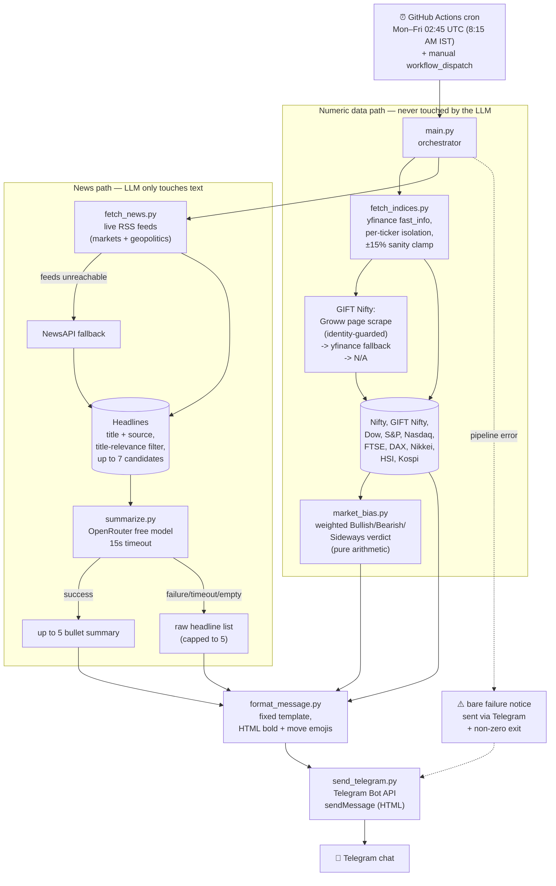

# Architecture

## Design rule

**The LLM never touches numbers.** All index prices/percentages are fetched
via `yfinance`/a page scrape and a deterministic bias calculation, then
slotted into a fixed message template. The OpenRouter model only ever
summarizes news headline *text* — it never sees or generates index data.

## Flow

## Index data sourcing

- Most indices: `yfinance` `fast_info` (Yahoo's own last-price/previous-close
  pair), falling back to a history-diff only if `fast_info` is unavailable.
  Any computed move beyond ±15% is treated as bad data rather than shown.
- **GIFT Nifty**: no reliable broker/free API covers it (it trades on NSE IX
  in GIFT City — not on NSE/BSE, so Groww's own quote API doesn't have it
  either). Current approach: scrape Groww's public GIFT Nifty page for its
  embedded page-data JSON, accepting a match only if it's tagged with an
  identity field mentioning nifty/gift/sgx (guards against grabbing a
  *different* index's number off the same page). Falls back to a couple of
  speculative `yfinance` tickers, then `N/A`, if the scrape fails.

## News sourcing

- **Primary**: live RSS feeds (Moneycontrol, Economic Times Markets,
  Business Standard, BBC World, Al Jazeera) — real-time, no API key, no
  publish-delay embargo.
- **Fallback**: NewsAPI `/everything`, used only if every RSS feed is
  unreachable. Its free tier embargoes very recent articles (~24h delay),
  which is why it's not the primary source.
- Headlines are filtered on **title-level** relevance — finance terms
  (Nifty, Sensex, RBI, crude, earnings, etc.) *and* geopolitical terms
  (war, sanctions, Israel, Iran, Ukraine, Russia, OPEC, etc.), since the
  latter routinely move oil/currency/risk sentiment without an explicit
  market word in the headline.

## Failure isolation

- Each index ticker is fetched independently — one dead/implausible value is
  marked "unavailable" rather than blocking the rest of the brief.
- News fetch and summarization failures fall back gracefully (RSS → NewsAPI
  → raw headlines → generic "no headlines" message) and never block
  delivery of the numeric data.
- If the whole pipeline throws unexpectedly, `main.py` still attempts to
  send a bare "brief failed, check logs" Telegram message and exits
  non-zero so the GitHub Actions run is flagged red.

## Secrets

All credentials are injected as GitHub Actions repo secrets, never
hardcoded: `TELEGRAM_BOT_TOKEN`, `TELEGRAM_CHAT_ID`, `OPENROUTER_API_KEY`,
`NEWS_API_KEY` (fallback only).
