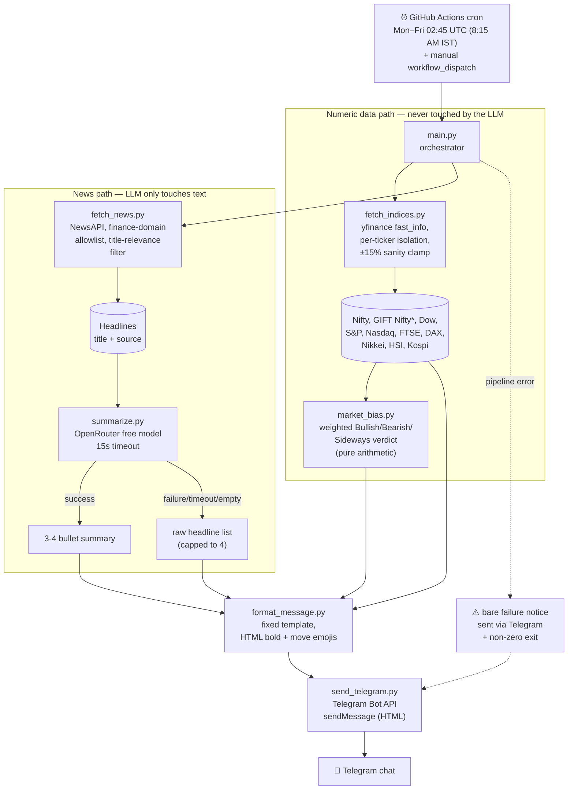

# Architecture

## Design rule

**The LLM never touches numbers.** All index prices/percentages are fetched
via `yfinance` and a deterministic bias calculation, then slotted into a
fixed message template. The OpenRouter model only ever summarizes news
headline *text* — it never sees or generates index data.

## Flow

`*` GIFT Nifty has no reliable free data source (it trades on NSE IX in GIFT
City, not covered by `yfinance` or Groww); currently reported as `N/A`.

## Failure isolation

- Each index ticker is fetched independently — one dead/implausible value is
  marked "unavailable" rather than blocking the rest of the brief.
- News fetch and summarization failures fall back gracefully (empty list →
  raw headlines → generic "no headlines" message) and never block delivery
  of the numeric data.
- If the whole pipeline throws unexpectedly, `main.py` still attempts to
  send a bare "brief failed, check logs" Telegram message and exits
  non-zero so the GitHub Actions run is flagged red.

## Secrets

All credentials are injected as GitHub Actions repo secrets, never
hardcoded: `TELEGRAM_BOT_TOKEN`, `TELEGRAM_CHAT_ID`, `OPENROUTER_API_KEY`,
`NEWS_API_KEY`.
